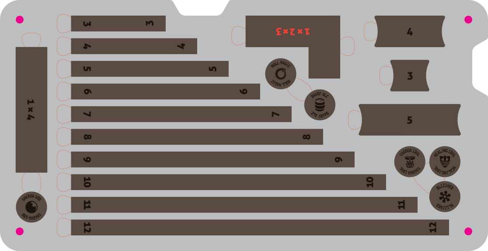

# Measuring stick set (large)
This tray is designed to be made from FOUR full sheets of 12x20" Proofgrade material. Recommend medium cherry for the bottom, medium walnut for the token layer, and two sheets of medium acrylic for the topper and optional tournament tray layer.

This tray is intended to fit inside a [Battlefoam Warmachine bag](https://us.battlefoam.com/warmachine-bag/) (8.5”x15.5”). Each layer is approximately 1/8” thick. Measurements in Illustrator were built at exact scale, then offset by `0.0035` for kerf. Magnet holes were inset by `–0.002` for a tight friction fit. Tournament tray cutouts are `51mm` in diameter.

---

### Materials
  * 1 sheet Proofgrade Medium Cherry Plywood (Finished)
  * 1 sheet Proofgrade Medium Walnut Plywood (Finished)
  * 2 sheets 1/8” clear acrylic
  *  [1/4” diameter magnets](https://www.kjmagnetics.com/products.asp?cat=1&scri=13&scri=17&scri=40)

### Top layer
  1. Settings for Medium Clear Acrylic
      * CUT:
        * Speed: `150`
        * Power: `FULL`
        * \# of Passes: `1`
        * Focus Height: `0.125`
      * ENGRAVE:
        * Speed: `700`
        * Power: `45`
        * LPI: `340`
        * \# of Passes: `1`
        * Focus Height: `0.125`
  2. One print:
      1. ENGRAVE the logo or top artwork (optional) first
      2. CUT the magnet holes
      3. CUT the outline last

### Tournament tray layer
  1. Settings for Medium Clear Acrylic
      * CUT:
        * Speed: `150`
        * Power: `FULL`
        * \# of Passes: `1`
        * Focus Height: `0.125`
  2. One print:
      1. CUT the magnet holes first
      2. CUT the 50mm base holes
      3. CUT the outline last

### Middle token layer
  NOTE: This is a COMPLEX print. Carefully plan ahead before starting!
  1. Proofgrade settings for Medium Walnut Plywood
      * CUT:
        * Speed: `160`
        * Power: `FULL`
        * \# of Passes: `1`
        * Focus Height: `0.13`
    * ENGRAVE:
        * Speed `500`
        * Power: `45`
        * \# of Passes: `1`
        * LPI: `340`
        * Focus Height: `0.13`
  2. First print:
      1. ENGRAVE the text layer first
      2. ENGRAVE the text for the 1x2x3 widget
      3. CUT the widget outlines last
      4. IGNORE other layers (finger holes, magnet holes, board outline)
  3. Second print:
      1. Carefully flip over the widgets without disturbing the position of the board
      2. Remove the 1x2x3 widget
      3. Repeat the ENGRAVE for the text layer on the back of the widgets
      4. IGNORE the 1x2x3 text layer
      5. IGNORE the widget outlines
      6. IGNORE other layers (finger holes, magnet holes, board outline)
  3. Third print:
      1. Carefully remove the widgets, without moving the board
      2. CUT the magnet holes
      3. CUT the outline of the board
      4. CUT the finger holes
      4. IGNORE other layers (finger holes, magnet holes, board outline)

### Bottom layer
  1. Proofgrade settings for Medium Cherry Plywood
      * CUT:
        * Speed: `163`
        * Power: `FULL`
        * \# of Passes: `1`
        * Focus Height: `0.118`
    * ENGRAVE:
        * Speed `500`
        * Power: `35`
        * \# of Passes: `1`
        * LPI: `340`
        * Focus Height: `auto`
  2. One print:
      1. ENGRAVE the text first
      2. CUT the magnet holes
      3. CUT the outline last

### Notes
  * Keep the masking paper on until the magnets are glued in place to catch any extra glue.
  * The acrylic layers can fog if exposed to the superglue while it's off-gassing, so I try to glue the magnets in, wait a minute or two before peeling off the contact paper, and then keep the layers separate overnight to let everything cure with good ventilation.
  * The faster/hotter engrave (500x45) on Walnut Ply came out nice and deep. It could go lighter in the future.
