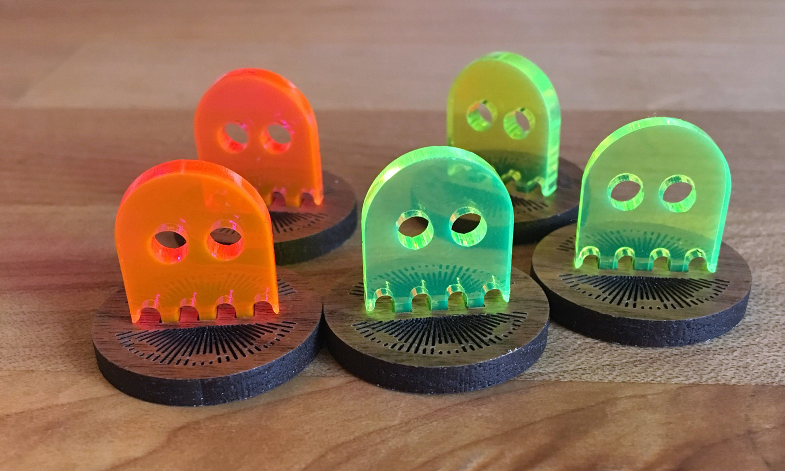

# Souls
I'm attempting to blend acrylic and hardwood in a 3D standee. Material thickness and kerf adjustments are crucial for a good friction fit here. Acrylic seems to be `0.11"`.

Note: Our meta often uses pink for bound soul tokens and yellow for unbound souls.

---

### Materials
  * Proofgrade Medium Walnut Hardwood
  * Proofgrade Medium Fluorescen Pink Acrylic
  * Proofgrade Medium Fluorescen Green Acrylic

### Base
  1. Proofgrade settings for Medium Walnut
      * SCORE:
        * Speed: `125`
        * Power: `11`
        * \# of Passes: `1`
        * Focus Height: `0.118`
      * CUT:
        * Speed: `189`
        * Power: `FULL`
        * \# of Passes: `1`
        * Focus Height: `0.118`
  2. First print:
      1. SCORE the monoline patterned areas
      2. CUT the outlines last

### Ghosts
  1. Proofgrade settings for Medium Fluorescent Green Acrylic (settings are identical for pink)
      * CUT:
        * Speed: `150`
        * Power: `FULL`
        * \# of Passes: `1`
        * Focus Height: `auto`
  2. First print:
      1. CUT the outlines

### Notes
    * Friction fit on these is very tight - no glue required. I might shave `.001` in the future for a glued version of these.
