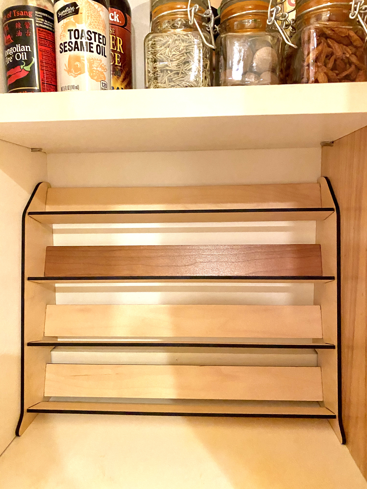

# Spice rack
This spice rack is made to fit inside my cupboard, to fit [2" jars like these](https://www.amazon.com/Encheng-Airtight-Rubber-Gasket-Kitchen/dp/B07G8TZVPZ/). Source files are exported from Fusion 360. The svg here is NOT corrected for laser kerf!

  * Glowforge thread: https://community.glowforge.com/t/spice-rack/77523
  * Thingiverse: https://www.thingiverse.com/thing:4736384

---

### Materials
  * I cut this from Proofgrade scrap I had on hand. Maple and one slat of Cherry iirc. Settings are Proofgrade defaults.

### Notes
  * The shelves are a little bit shallow. The wire bail on the jars keeps them from resting flat on their sides and the glass lids make them top heavy. In future versions, I would make the shelves deeper to avoid bottles falling out.
  * My measurements for the space were too exact, and getting this unit in was actually difficult because there was no wiggle room to rotate it in. In the future, leave an 1/8" of play.
